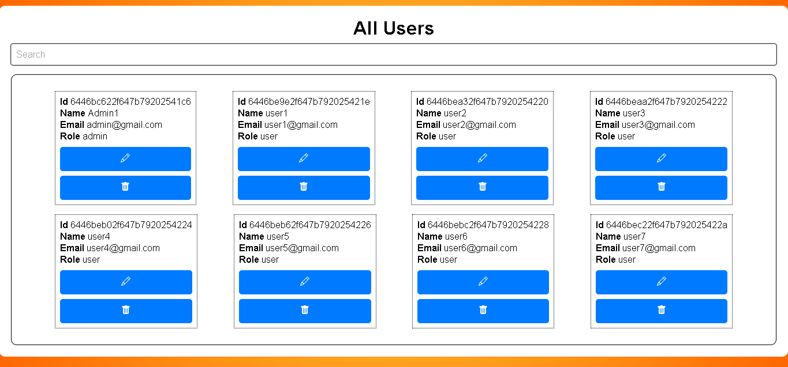
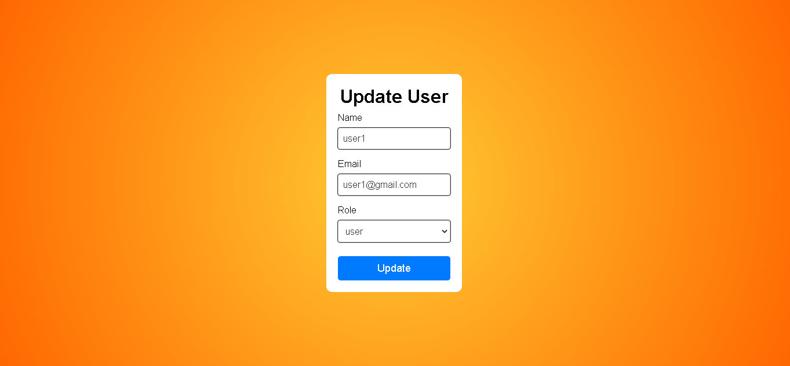
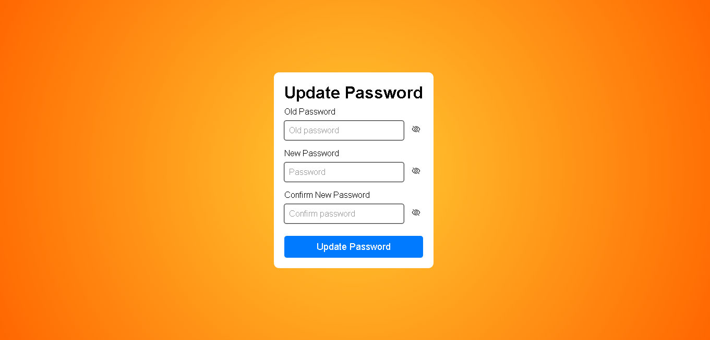

<h1 align="center">🔒 Authentication App 🔑</h1>

<p align="center">
This is a web application that provides authentication functionality for users with two roles: user and admin. The app allows users to register, login, view and update their profile, update their password, and recover their password if forgotten. Admin users also have access to a dashboard where they can see and edit all user accounts.
</p>

<br>

## Stack Used 📚📚📚

<br>

- **M**ongoDB: A NoSQL database used for storing user account information
- **E**xpress.js: A Node.js web application framework used for building the API server
- **R**eact.js: A JavaScript library used for building the frontend user interface
- **N**ode.js: A JavaScript runtime environment used for running the API server

<hr>
<br>

## Technologies Used ⚙️⚙️⚙️

<br>

### Backend

- bcrypt: A library used for hashing passwords before storing them in the database
- cookie-parser: A library used for parsing cookies in the API server
- JSON Web Token (JWT): A library used for authentication and authorization in the API server and frontend application
- mongoose: An Object Data Modeling (ODM) library used for interacting with MongoDB in Node.js
- nodemailer: A library used for sending password recovery emails to users
- dotenv: A library used for loading environment variables from a .env file into the Node.js runtime environment

### Frontend

- **Vite**: A build tool that provides fast and efficient development server with hot module replacement and optimized production builds. It is used to serve and bundle the frontend code in this project.
- @reduxjs/toolkit: A library that provides a simple and efficient way to manage the application state in Redux. It includes utilities to simplify common Redux use cases like store setup, creating reducers, and writing immutable update logic.
- axios: A library used for making HTTP requests from the frontend to the API server.
- react-dom: A library used for rendering the React components in the browser.
- react-redux: A library that provides a way to connect the React components with the Redux store and dispatch actions.
- react-router-dom: A library used for declaratively routing the frontend application based on the current URL.
- redux-persist: A library used for persisting the Redux store data to local storage or other storage solutions.
- redux-persist-transform-encrypt: A library used in conjunction with redux-persist for encrypting the persisted data.
- redux-thunk: A middleware library for Redux that allows writing asynchronous logic in the Redux actions.

<hr>

<br>

## Features ⭐⭐⭐

<br>

### Register

New users can register for an account by providing their username, email and password as well as selecting avatar they prefer.

<br>

### Login

Registered users can log in using their email and password.

<br>

### Profile

Users can view their profile information, including their username, email, avatar and date of account creation. They can also update their profile and change password if necessary.

<br>

### Update Profile

Users can update their profile information, including their username, email and avatar.

<br>

### Update Password

Users can update their password by providing their current password and a new password.

<br>

### Forgot Password

Users who have forgotten their password can request a password reset by providing their email. The app will send an email to the user with a recovery link. Link will take the user to a page where they can enter a new password.

<br>

### New Password

After successfully creating a new password, the user will be able to log in with their email and the new password.

<br>

### Dashboard (Admin Only)

Admin users have access to a dashboard where they can view and edit all user accounts.

<br>

### Roles

User: Regular users who can register, login, and manage their own accounts.
<br>
Admin: Users with administrative privileges who can manage all user accounts and view statistics.

<hr>
<br>

## Getting Started ▶️▶️▶️

1. Clone the repository: `git clone https://github.com/igornikic/MERN-Authentication.git`
2. Navigate to the root directory of the project: `cd authentication`
3. Install backend dependencies: `npm install`
4. Start the backend server: `npm run dev` (This will start the backend server on port 4000 in development mode)
5. Open a new terminal window and navigate to the frontend directory: `cd frontend`
6. Install frontend dependencies: `npm install`
7. Start the frontend server: `npm run dev` (This will start the frontend server with Vite on port 5173 in development mode)
8. Open a web browser and navigate to `http://localhost:5173` to access the app.

- Note: If you encounter any issues, make sure that you have Node.js and npm installed on your machine, and that you have the correct versions of the required dependencies installed.

<br>

## Environment Variables 🌍🌍🌍

<br>

This project uses a .env file to define environment variables for the application. The .env file should be created at the root of the project directory with the following variables defined:

<br>

backend/config/config.env

```
PORT = 4000
NODE_ENV = DEVELOPMENT
FRONTEND_URL = http://127.0.0.1:5173
DB_LOCAL_URI = YOUR_MONGODB_URI

JWT_SECRET = YOUR_JWT_SECRET
JWT_EXPIRES_TIME = 7d
COOKIE_EXPIRES_TIME = 7

SMTP_EMAIL = YOUR_EMAIL
SMTP_FROM_EMAIL = YOUR_EMAIL
SMTP_PASSWORD = YOUR_PASSWORD
SMTP_FROM_NAME = Test - Authentication
```

<br>

frontend/.env

```
VITE_ENCRYPTION_KEY = YOUR_ENCRYPTION_KEY
```

<br>

## App Preview 📷 (some parts of app)

<br>


<br>


<br>


<br>


<br>



<br>



<br>



<br>

## License ⚖️

This project is licensed under the MIT License. See the `LICENSE` file for details.
